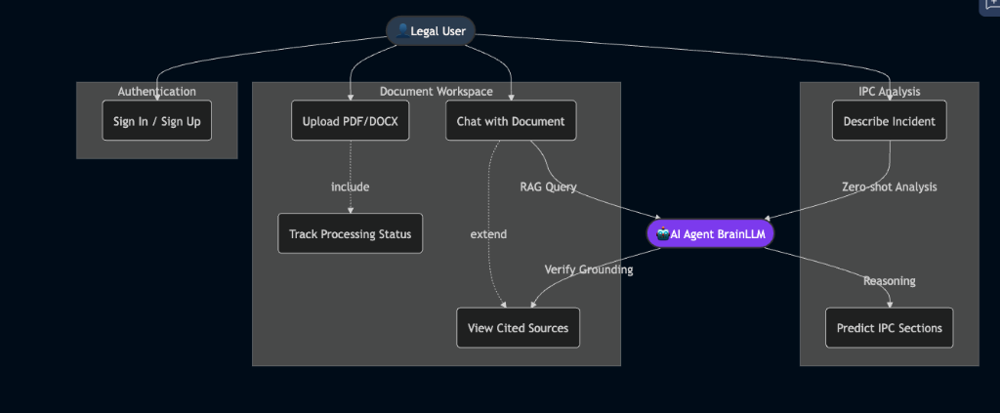

# JurisQuery.ai

> **Your Intelligent Legal Assistant. Powered by RAG.**

JurisQuery is a next-generation legal tech platform that simplifies complex document analysis. Upload legal contracts, ask natural language questions, and receive instant, citation-backed answers. Transform hours of manual reading into seconds of automated insight.


---

## 📋 Table of Contents

- [Features](#-features)
- [API Keys Required](#-api-keys-required)
- [Architecture](#-architecture)
- [Technology Stack](#-technology-stack)
- [Getting Started](#-getting-started)
- [Project Structure](#-project-structure)
- [Backend Deep Dive](#-backend-deep-dive)
- [Frontend Deep Dive](#-frontend-deep-dive)
- [RAG Pipeline](#-rag-pipeline)
- [Database Schema](#-database-schema)
- [API Reference](#-api-reference)

---

## 🎯 Features

### Core Features

| Feature | Description |
|---------|-------------|
| **📄 Drag-and-Drop Upload** | Intuitive file upload supporting PDF, DOCX, and TXT formats up to 50MB |
| **⚡ Real-time Processing** | Live status updates: `Uploading → Processing → Vectorizing → Ready` |
| **💬 AI Chat Interface** | ChatGPT-style conversation interface with your documents |
| **🔍 RAG-Powered Answers** | Retrieval-Augmented Generation ensures factual, document-grounded responses |
| **📌 Citation Highlights** | Every answer includes clickable citations with page/paragraph references |
| **⚖️ IPC Section Predictor** | AI-powered prediction of applicable Indian Penal Code sections from crime descriptions |
| **🧠 BrainLLM Meta-Reasoning** | Query optimization, response verification, and automatic refinement |
| **🔐 Secure Authentication** | Clerk-powered authentication with JWT backend validation |
| **📊 Dashboard Analytics** | Track documents, processing status, and usage metrics |

### User Experience

- **Split-Screen Interface**: View documents and chat side-by-side
- **Premium Design**: Glassmorphism, micro-animations, responsive layouts
- **Professional SaaS Layout**: Sidebar navigation, top header, card-based UI
- **Dark/Light Mode Ready**: Color palette supports theming

### System Use Cases



---

## 🔑 API Keys Required

### Development & Testing (Free Tier)

| Service | Keys Needed | Free Tier Limits | Get Key |
|---------|-------------|------------------|---------|
| **Google Gemini** | 1 | 1,500 req/day (Flash), 1,500 req/day (embeddings) | [Google AI Studio](https://aistudio.google.com/app/apikey) |
| **Qdrant Cloud** | 1 | 1GB storage, 1M vectors | [Qdrant Cloud](https://cloud.qdrant.io) |
| **Cloudinary** | 1 | 25GB storage, 25GB bandwidth/month | [Cloudinary](https://cloudinary.com) |
| **Clerk** | 1 | 10,000 MAU | [Clerk](https://clerk.com) |
| **Neon PostgreSQL** | 1 | 0.5GB storage, 1 project | [Neon](https://neon.tech) |

**Total for Development: 5 API Keys (all free tier)**

### Production (Paid Tier Recommendations)

| Service | Recommended Plan | Estimated Cost | Notes |
|---------|------------------|----------------|-------|
| **Google Gemini** | Pay-as-you-go | ~$0.075/1M input tokens | Scale with usage |
| **Qdrant Cloud** | Starter ($25/mo) | $25/month | 4GB RAM, dedicated |
| **Cloudinary** | Plus ($99/mo) | $99/month | More storage/bandwidth |
| **Clerk** | Pro ($25/mo) | $25/month | 10K+ MAU |
| **Neon PostgreSQL** | Launch ($19/mo) | $19/month | 10GB storage |

**Estimated Production Cost: ~$168/month** (for moderate usage)

### Optional: Alternative LLM (Groq)

| Service | Keys Needed | Free Tier | Use Case |
|---------|-------------|-----------|----------|
| **Groq** | 1 (optional) | 14,400 req/day | Faster inference (Llama 3.3 70B) |

---

## 🏗️ Architecture

### System Overview

```
┌─────────────────────────────────────────────────────────────────────────────┐
│                              CLIENT LAYER                                    │
│  ┌───────────────────────────────────────────────────────────────────────┐  │
│  │                        Next.js 16 Frontend                             │  │
│  │  ┌─────────────┐  ┌─────────────┐  ┌─────────────┐  ┌─────────────┐   │  │
│  │  │  Dashboard  │  │  Document   │  │    Chat     │  │   Landing   │   │  │
│  │  │   Module    │  │   Viewer    │  │  Interface  │  │    Pages    │   │  │
│  │  └──────┬──────┘  └──────┬──────┘  └──────┬──────┘  └─────────────┘   │  │
│  │         │                │                │                            │  │
│  │         └────────────────┴────────────────┘                            │  │
│  │                          │                                              │  │
│  │                ┌─────────┴─────────┐                                   │  │
│  │                │   API Service     │                                   │  │
│  │                │   (ragService.ts) │                                   │  │
│  │                └─────────┬─────────┘                                   │  │
│  └──────────────────────────┼─────────────────────────────────────────────┘  │
└─────────────────────────────┼───────────────────────────────────────────────┘
                              │ HTTP/REST
                              ▼
┌─────────────────────────────────────────────────────────────────────────────┐
│                              API LAYER                                       │
│  ┌───────────────────────────────────────────────────────────────────────┐  │
│  │                      FastAPI Backend                                   │  │
│  │  ┌────────────┐  ┌────────────┐  ┌────────────┐  ┌────────────┐       │  │
│  │  │   Auth     │  │ Documents  │  │    RAG     │  │    Chat    │       │  │
│  │  │  Router    │  │   Router   │  │   Router   │  │   Router   │       │  │
│  │  └────────────┘  └────────────┘  └────────────┘  └────────────┘       │  │
│  └───────────────────────────────────────────────────────────────────────┘  │
└─────────────────────────────────────────────────────────────────────────────┘
                              │
                              ▼
┌─────────────────────────────────────────────────────────────────────────────┐
│                            DATA LAYER                                        │
│  ┌──────────────┐  ┌──────────────┐  ┌──────────────┐  ┌──────────────┐     │
│  │   Neon       │  │   Qdrant     │  │  Cloudinary  │  │   Gemini     │     │
│  │ PostgreSQL   │  │   Cloud      │  │   Storage    │  │  2.0 Flash   │     │
│  └──────────────┘  └──────────────┘  └──────────────┘  └──────────────┘     │
└─────────────────────────────────────────────────────────────────────────────┘
```

---

## 🛠️ Technology Stack

### Backend Technologies

| Category | Technology | Purpose |
|----------|------------|---------|
| **Framework** | FastAPI 0.115+ | Async Python web framework |
| **Runtime** | Python 3.12+ | Programming language |
| **Package Manager** | uv | Fast dependency management |
| **Database** | Neon PostgreSQL | Serverless Postgres |
| **ORM** | SQLAlchemy 2.0 | Async database operations |
| **Migrations** | Alembic | Schema version control |
| **Vector DB** | Qdrant Cloud | Similarity search |
| **File Storage** | Cloudinary | Document hosting |
| **LLM** | Gemini 2.0 Flash | Text generation (with key rotation) |
| **Embeddings** | text-embedding-004 | 768-dim vectors |
| **Fallback LLM** | Groq LLaMA 3.3 | Backup inference |

### Frontend Technologies

| Category | Technology | Purpose |
|----------|------------|---------|
| **Framework** | Next.js 16 | React with App Router |
| **Language** | TypeScript 5 | Type safety |
| **Styling** | TailwindCSS 4 | Utility-first CSS |
| **Auth** | Clerk | User authentication |
| **Animations** | Framer Motion | Smooth transitions |
| **Icons** | Lucide React | Premium icons |
| **File Upload** | react-dropzone | Drag-and-drop |

---

## 🚀 Getting Started

### Prerequisites

| Tool | Version | Installation |
|------|---------|--------------|
| Node.js | 20+ | [nodejs.org](https://nodejs.org) |
| Python | 3.12+ | [python.org](https://python.org) |
| uv | Latest | `curl -LsSf https://astral.sh/uv/install.sh \| sh` |

### 1. Clone Repository

```bash
git clone https://github.com/Abhijeetsingh0022/JurisQuery.git
cd JurisQuery
```

### 2. Backend Setup

```bash
cd backend
uv sync
cp .env.example .env
# Edit .env with your API keys
uv run alembic upgrade head
uv run uvicorn src.main:app --reload --port 8000
```

### 3. Frontend Setup

```bash
cd frontend
npm install
cp .env.local.example .env.local
# Edit .env.local with your Clerk keys
npm run dev
```

### 4. Access Application

| URL | Description |
|-----|-------------|
| http://localhost:3000 | Frontend |
| http://localhost:3000/dashboard | Dashboard |
| http://localhost:8000/docs | API Docs |

---

## 📁 Project Structure

### Backend

```
backend/
├── src/
│   ├── auth/          # JWT validation, Clerk integration
│   ├── documents/     # Upload, list, status endpoints
│   ├── rag/           # Embeddings, vectorstore, hybrid search
│   ├── chat/          # Session & message management
│   ├── ipc/           # IPC Section Prediction feature
│   ├── llm/           # Gemini, Groq, BrainLLM
│   ├── storage/       # Cloudinary file storage
│   └── main.py        # FastAPI application
├── alembic/           # Database migrations
└── pyproject.toml     # Dependencies
```

### Frontend

```
frontend/
├── src/
│   ├── app/           # Next.js App Router pages
│   ├── components/    # Dashboard, layout components
│   ├── features/      # Document upload, chat
│   ├── services/      # API client
│   └── types/         # TypeScript interfaces
└── package.json
```

---

## 🔧 Backend Deep Dive

### Configuration Management

All settings centralized in `src/config.py` using Pydantic Settings. Environment variables loaded from `.env` file include database URL, API keys for Gemini/Qdrant/Cloudinary, JWT secrets, and app settings.

### Database Layer

- **Engine**: Async SQLAlchemy with `asyncpg` driver for Neon PostgreSQL
- **Sessions**: Async session factory with automatic commit/rollback
- **Migrations**: Alembic with async support for schema versioning

### Authentication Flow

1. **Frontend**: Clerk handles user signup/login, issues JWT tokens
2. **Backend**: `get_current_user` dependency validates JWT on protected routes
3. **Development**: Falls back to mock user when no token provided (dev mode only)

### Error Handling

Custom exception hierarchy (`AppError`, `NotFoundError`, `UnauthorizedError`, `ValidationError`) with FastAPI exception handlers for consistent error responses.

### Service Layer Pattern

Each module follows router → service → model pattern:
- **Router**: FastAPI endpoints, request validation
- **Service**: Business logic, database operations
- **Model**: SQLAlchemy ORM definitions

---

## 🎨 Frontend Deep Dive

### App Router Structure

- **(public)/** - Landing pages with header/footer layout
- **dashboard/** - SaaS layout with sidebar, no header/footer
- **documents/[id]/** - Document analysis with chat interface

### Component Architecture

Dashboard uses composition pattern with separate components:
- **Sidebar**: Navigation, user profile
- **TopHeader**: Search, notifications
- **StatsCards**: Document metrics
- **QuickActions**: Upload section
- **DocumentsList**: Document grid with cards

### API Service Layer

Centralized API client (`services/api/client.ts`) handles:
- Base URL configuration
- Content-Type headers
- Error response handling
- File upload with progress tracking

### State Management

- **Server State**: React hooks with useCallback for data fetching
- **Local State**: useState for UI state (modals, forms)
- **URL State**: Next.js App Router for navigation

### Type Safety

TypeScript interfaces for all API responses:
- `Document`, `DocumentStatus` - Document types
- `Citation`, `QueryResponse` - RAG types
- `ChatSession`, `ChatMessage` - Chat types

---

## 🔍 RAG Pipeline

### Overview

JurisQuery uses **Retrieval-Augmented Generation (RAG)** to provide accurate, citation-backed answers from legal documents.

### RAG Architecture

```
┌─────────────────────────────────────────────────────────────────────────────────┐
│                              INDEXING PIPELINE                                   │
│  ┌─────────────┐   ┌─────────────┐   ┌─────────────┐   ┌─────────────────────┐  │
│  │   Document  │   │    Text     │   │   Chunking  │   │    Embedding        │  │
│  │   Upload    │──▶│  Extraction │──▶│   (512 tok) │──▶│  (768 dimensions)   │  │
│  │   (PDF)     │   │             │   │  (50 overlap)│   │  text-embedding-004 │  │
│  └─────────────┘   └─────────────┘   └─────────────┘   └──────────┬──────────┘  │
│                                                                    │             │
│                                                                    ▼             │
│                                                          ┌─────────────────────┐ │
│                                                          │    Qdrant Cloud     │ │
│                                                          │  (Vector Storage)   │ │
│                                                          └─────────────────────┘ │
└─────────────────────────────────────────────────────────────────────────────────┘

┌─────────────────────────────────────────────────────────────────────────────────┐
│                               QUERY PIPELINE                                     │
│  ┌─────────────┐   ┌─────────────┐   ┌─────────────┐   ┌─────────────────────┐  │
│  │    User     │   │   Query     │   │   Vector    │   │   Top-K Chunks      │  │
│  │  Question   │──▶│  Embedding  │──▶│   Search    │──▶│   Retrieved         │  │
│  │             │   │  (768 dim)  │   │  (Cosine)   │   │   (Ranked by score) │  │
│  └─────────────┘   └─────────────┘   └─────────────┘   └──────────┬──────────┘  │
│                                                                    │             │
│                                                                    ▼             │
│                    ┌─────────────────────────────────────────────────────────┐   │
│                    │                  CONTEXT BUILDING                        │   │
│                    │   [Source 1: Page 5, Para 2] "Termination clause..."    │   │
│                    │   [Source 2: Page 12, Para 1] "Notice period..."        │   │
│                    └─────────────────────────────────────────────────────────┘   │
│                                                                    │             │
│                                                                    ▼             │
│  ┌─────────────┐   ┌─────────────────────────────────────────────────────────┐  │
│  │   Answer    │◀──│                  Gemini 2.0 Flash                        │  │
│  │ + Citations │   │   "Based on the document, termination requires..."      │  │
│  └─────────────┘   └─────────────────────────────────────────────────────────┘  │
└─────────────────────────────────────────────────────────────────────────────────┘
```

### Two-Phase Pipeline

**Phase 1: Indexing (Document Upload)**

| Step | Process | Component |
|------|---------|-----------|
| 1 | User uploads PDF/DOCX/TXT | Frontend |
| 2 | File stored in Cloudinary | Storage Service |
| 3 | Text extracted from document | Document Processor |
| 4 | Text split into 512-token chunks (50 overlap) | Chunker |
| 5 | Chunks embedded (768-dim vectors) | Gemini Embeddings |
| 6 | Vectors stored with metadata | Qdrant Cloud |

**Phase 2: Query (User Question)**

| Step | Process | Component |
|------|---------|-----------|
| 1 | User asks natural language question | Chat Window |
| 2 | Question converted to 768-dim vector | Gemini Embeddings |
| 3 | Cosine similarity search | Qdrant Cloud |
| 4 | Top-5 relevant chunks retrieved | Vector Store |
| 5 | Context built with source labels | RAG Service |
| 6 | BrainLLM optimizes query (rewriting, entities) | Brain LLM |
| 7 | Answer generated with citations | Gemini 2.0 Flash |
| 8 | Response verified for grounding | Brain LLM |

### Key Components

| Component | File | Description |
|-----------|------|-------------|
| **Embeddings** | `embeddings.py` | Gemini text-embedding-004, 768 dimensions |
| **Vector Store** | `vectorstore.py` | Qdrant client with upsert, search, delete |
| **LLM** | `gemini.py` | Gemini 2.0 Flash with API key rotation |
| **Brain LLM** | `brain.py` | Query analysis, response verification, refinement |
| **Prompts** | `prompts.py` | Legal domain prompts for RAG, summarization |
| **Service** | `service.py` | Query pipeline orchestration |

### Prompt Engineering

The legal RAG prompt instructs the LLM to:
1. Answer ONLY from provided context
2. Say "I couldn't find this" if not in context
3. Always cite sources with [Source X] format
4. Use professional legal language
5. Be precise and avoid speculation

### Advanced RAG Features

#### Hybrid Search with RRF Fusion

JurisQuery combines vector and keyword search for optimal retrieval:

| Search Type | Source | Purpose |
|-------------|--------|---------|
| **Vector Search** | Qdrant | Semantic similarity matching |
| **Keyword Search** | PostgreSQL | Exact term matching |
| **RRF Fusion** | Service | Reciprocal Rank Fusion to merge and re-rank results |

#### Parent-Child Chunking

```
PARENT (~2000 chars) ─────────────────────────────────────────────────
    │
    ├── CHILD (~500 chars) ← Embedded in Qdrant for precise search
    ├── CHILD (~500 chars) ← Embedded in Qdrant for precise search
    └── CHILD (~500 chars) ← Embedded in Qdrant for precise search
```

- **Search on children**: Smaller chunks provide precise similarity matching
- **Return parents**: Larger context chunks provide richer LLM context

#### BrainLLM Meta-Reasoning

| Function | Purpose |
|----------|---------|
| `analyze_query()` | Query type detection, entity extraction, query rewriting |
| `verify_response()` | Check if response is grounded in citations |
| `refine_response()` | Fix ungrounded claims when confidence is low |

### Configuration Parameters

| Parameter | Value | Description |
|-----------|-------|-------------|
| Chunk Size | 512 tokens | Text chunk size |
| Chunk Overlap | 50 tokens | Overlap between chunks |
| Embedding Dim | 768 | Vector dimensions |
| Top-K | 5 | Chunks per query |
| Temperature | 0.3 | LLM sampling (factual) |
| Distance | Cosine | Similarity metric |

---

## 🗄️ Database Schema

### Entity Relationship

```
documents ──────┬──────▶ document_chunks
                │
                └──────▶ chat_sessions ──────▶ messages
```

### Tables

| Table | Key Fields | Description |
|-------|------------|-------------|
| **documents** | id, user_id, filename, status, file_url | Uploaded documents |
| **document_chunks** | id, document_id, content, page_number, vector_id | Text chunks with metadata |
| **chat_sessions** | id, document_id, user_id, title | Chat conversations |
| **messages** | id, session_id, role, content, citations | Individual messages |

### Document Status Flow

```
pending → uploading → processing → vectorizing → ready
                                               ↘ failed
```

---

## 📡 API Reference

### Documents API

| Method | Endpoint | Description |
|--------|----------|-------------|
| `POST` | `/api/documents/upload` | Upload document |
| `GET` | `/api/documents` | List documents |
| `GET` | `/api/documents/{id}` | Get document |
| `GET` | `/api/documents/{id}/status` | Get status |
| `DELETE` | `/api/documents/{id}` | Delete document |

### RAG API

| Method | Endpoint | Description |
|--------|----------|-------------|
| `POST` | `/api/rag/query` | Query document with RAG |

### IPC API

| Method | Endpoint | Description |
|--------|----------|-------------|
| `POST` | `/api/v1/ipc/predict` | Predict IPC sections from crime description |
| `GET` | `/api/v1/ipc/sections` | List all IPC sections (paginated) |
| `GET` | `/api/v1/ipc/sections/{num}` | Get specific IPC section details |

### Chat API

| Method | Endpoint | Description |
|--------|----------|-------------|
| `POST` | `/api/chat/sessions` | Create session |
| `GET` | `/api/chat/sessions` | List sessions |
| `POST` | `/api/chat/sessions/{id}/messages` | Send message |
| `DELETE` | `/api/chat/sessions/{id}` | Delete session |

---

## 📄 License

MIT License - see [LICENSE](LICENSE) for details.

---

## 📧 Contact

**JurisQuery Team** - [@Abhijeetsingh0022](https://github.com/Abhijeetsingh0022)

---

Built with ❤️ using Next.js, FastAPI, and Gemini AI
