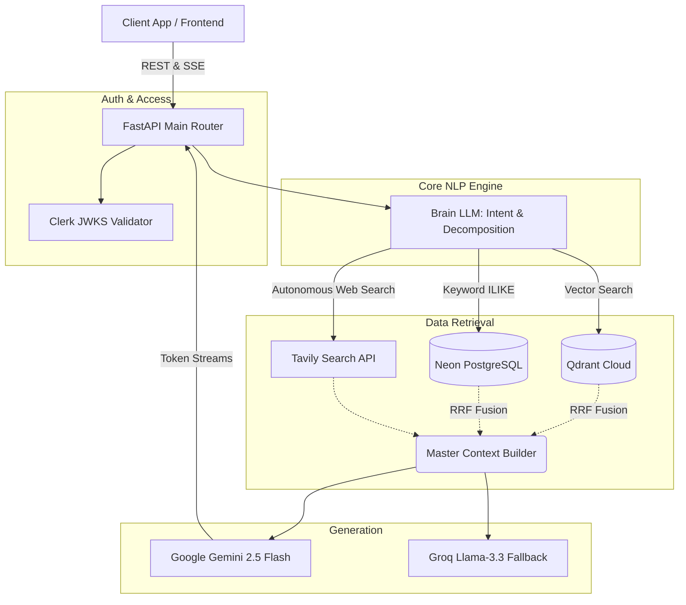

<div align="center">
  <h1>🏛️ JurisQuery Backend API</h1>
  <p><strong>Enterprise-Grade Legal Intelligence & Agentic RAG Framework</strong></p>
  
  [](https://python.org)
  [](https://fastapi.tiangolo.com)
  [](https://postgresql.org)
  [](https://qdrant.tech)
</div>

---

## 📖 Overview

The **JurisQuery Backend** is a high-performance, asynchronous REST API built on [FastAPI](https://fastapi.tiangolo.com/). It powers advanced legal document analysis through a meticulously engineered AI pipeline. Designed for high availability and structural rigor, the backend incorporates Agentic Web Research, Reciprocal Rank Fusion (RRF), and real-time Server-Sent Events (SSE) streaming to deliver precise, citation-backed legal insights.

---

## 🏗 System Architecture

The core processing pipeline orchestrates interactions between traditional RDBMS storage, high-dimensional vector space, and multiple LLM providers.



---

## ✨ Core Technical Capabilities

### 1. Multi-Modal Retrieval-Augmented Generation (RAG)
* **Hierarchical Chunking Strategy:** Documents are parsed into **Child chunks** (~500 chars) for high-accuracy localized vector matching, which then pull in their respective **Parent chunks** (~2000 chars) to provide rich, surrounding context to the LLM.
* **Hybrid Search with RRF:** Merges semantic similarity (via `models/gemini-embedding-004`) with traditional database keyword search to ensure zero data misses, fused via Reciprocal Rank Fusion.
* **Branched "Map-Reduce" RAG:** When querying a **Case Folder** (multiple documents), the system autonomously decomposes the user query into localized sub-queries, executes parallel asynchronous retrieval mappings across all documents, and synthesizes a master response.

### 2. Autonomous Agentic Web Research
* Dynamically identifies out-of-scope or general legal queries.
* Orchestrates headless web searches via the **Tavily API**, executing multi-step evaluations.
* Exposes an overarching **Server-Sent Events (SSE)** interface, bridging real-time status updates (e.g., `Searching web for precedence...`) directly to the frontend before seamlessly transitioning into token-by-token text generation.

### 3. The "Brain" Orchestrator
A specialized supervisor AI layer (`app/llm/brain.py`) controlling traffic flow:
* **Query Re-Writing & Entity Extraction:** Cleans conversational inputs into optimized boolean and semantic query vectors.
* **Reflective Output Verification:** Systematically cross-references generated outputs against the retrieved context to aggressively detect and eliminate hallucinations.

### 4. BNS-IPC Transitional Bridge
Native accommodations for the Indian judicial transition (`app/ipc/bns_service.py`):
* Context responses referencing legacy **Indian Penal Code (IPC)** infractions dynamically inject cross-references to the modern **Bharatiya Nyaya Sanhita (BNS) 2023** statutes.

---

## 📂 Project Topology

| Module | Purpose | Key Technologies |
| :--- | :--- | :--- |
| `app/auth/` | Zero-trust authentication enforcing remote RS256 token verification. | `jose`, JWKS Caching |
| `app/documents/` | Asynchronous file parsing (PDF/DOCX) and cloud persistence. | `pypdf`, `docx`, Cloudinary |
| `app/rag/` | Chunking heuristics, Qdrant upserts, and complex retrieval pipelines. | `gemini-cli`, Qdrant |
| `app/research/` | Headless data acquisition logic and agentic chain loops. | Tavily Search API |
| `app/chat/` | Persistent historical dialogue tracking and core SSE HTTP bridges. | FastAPI BackgroundTasks |
| `app/llm/` | Polymorphic generator interfaces and self-reflection layers. | Gemini, Groq, AsyncIO |

---

## 🛠 Deployment & Setup Instructions

JurisQuery utilizes `uv`, the lightning-fast Python package and environment manager written in Rust.

### Prerequisites
* Python 3.10+
* Local or Remote PostgreSQL Server
* [Qdrant Cloud](https://cloud.qdrant.io/) Cluster

### 1. Environment Configuration
Duplicate the configuration template to initialize your local environment:
```bash
cp .env.example .env
```
Ensure the following critical environment matrices are populated:
* `DATABASE_URL`: Your PostgreSQL connection string.
* `QDRANT_URL` / `QDRANT_API_KEY`: Vector persistence credentials.
* `GEMINI_API_KEY` / `GROQ_API_KEY`: Generative AI access tokens.
* `TAVILY_API_KEY`: API token required for the Agentic Web pipeline.
* `CLERK_FRONTEND_API`: Origin parameter for verifying stateless JWTs.

### 2. Dependency Resolution
```bash
# Initialize isolated virtual environment and fetch strict dependencies
uv venv
source .venv/bin/activate
uv pip install -e .
```

### 3. Database Introspection & Seeding
```bash
# Push declarative SQLAlchemy schemas to the remote Postgres provider
uv run alembic upgrade head

# Seed initial internal data (IPC → BNS lookup tables)
uv run load_db.py
```

### 4. Launching the Cluster
Initialize the ASGI web server directly:
```bash
uv run uvicorn app.main:app --host 0.0.0.0 --port 8000 --reload
```
---

## 🔐 Security & Reliability
- **Stateless Tokens:** Zero session state handled internally; strict adherence to remote Identity Provider definitions via asymmetrical key rotation.
- **Failovers:** Out-of-the-box support for falling back from Gemini to Llama-3 instances in the event of upstream rate-limiting (`429`) or provider degradation.
- **Data Pruning:** Isolated cascade relationships utilizing `delete-orphan` parameters ensure stringent compliance with user-deletion mandates.
